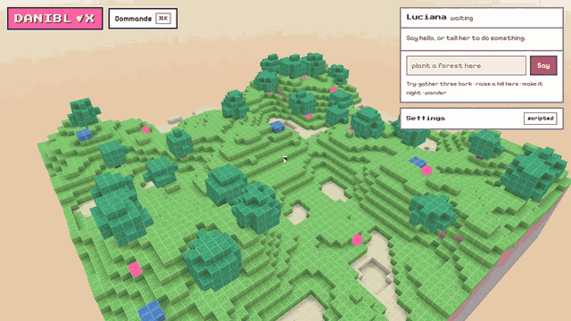

# Daniblox



**Play it now: [metamorales.github.io/daniblox](https://metamorales.github.io/daniblox/)**

A cozy voxel sandbox in the browser with two residents: Luciana, a curious
and slightly mischievous tuxedo cat, and Xochi, a calm dilute calico. They do
what you type. Ask one to gather bark, plant a forest, raise a hill, build a
cat tower, or make it night, in plain words. Talk to them and they talk back,
and to each other when you leave them alone. Everything runs in your browser,
saves to your browser, and needs no account, no server and no key. Plug in a
language model, local or hosted, and they stop needing exact wording.

## Quickstart

```bash
git clone https://github.com/metamorales/daniblox.git && cd daniblox
npm install
npm run dev
```

Then open the address Vite prints. `npm test` runs the unit tests, `npm run
e2e` the browser tests, and `npm run lint` everything else.

## Controls

| Do this                      | Desktop                                | Phone                      |
| ---------------------------- | -------------------------------------- | -------------------------- |
| Look around                  | left-drag                              | one finger                 |
| Move the view                | right-drag, Shift-drag, W A S D        | two fingers                |
| Zoom                         | wheel or two-finger scroll             | pinch                      |
| Re-centre                    | double-click                           |                            |
| Choose what to do to a block | click it                               | tap or hold it             |
| Break or place yourself      | Alt-click, Shift-click, or the menu    | the menu                   |
| Talk to the cats             | the box in the panel, or Ctrl/Cmd K    | the box in the sheet       |
| Pick who you are talking to  | click her card, or start with her name | tap her card               |
| Bring the camera to her      | F, or the palette                      | the palette                |
| Choose the block you place   | the swatches under the box             | the swatches under the box |
| Settings                     | the panel                              | raise the sheet            |

"Here" and "me" mean the pale ring on the ground, which is the point the
camera orbits. "This" means the block under your pointer.

## What she understands

Small jobs, done on foot:

```
gather three bark · mine this · place a tile here · go here · follow me · wander · stop
```

World-scale powers, done at once:

```
raise a hill here · lower this · flatten this · paint this gem
plant a forest here · scatter gems here · clear this · make it night
```

Up to three phrases joined with "then". Numbers as digits or words up to
sixteen. Block names and their everyday synonyms both work: `bark` or `wood`,
`clover` or `grass`, `pebble` or `stone`, `shell` or `sand`, `tile` or
`brick`, `gem` or `crystal`. Anything else is conversation.

Things to build, from what she carries. She fetches what she is short of
first, and says so:

```
build a cat tower here · build a little house here · build a litter box here
```

A cat tower is fourteen bark and a gem, a house twenty-three bark, a litter
box eight bark and a shell. Start a line with a name, "Xochi, follow me", to
pick who does it; otherwise it goes to whichever card is selected.

## Brains

The cats always work with the built-in scripted brain: a parser for the
grammar above and dialogue written in her voice. Point her at a model under
**Settings** and the model takes over, with every reply checked against a
closed list of actions before anything happens in the world. A reply that
fails the check is asked for once more, then her own words take the turn and
a badge says so.

**A model on your own machine (free, private).** Install
[Ollama](https://ollama.com), pull a model, and leave the settings at their
defaults:

```bash
ollama pull qwen3.5:9b
```

Address `http://localhost:11434/v1`, model `qwen3.5:9b`, no key. This works
when Daniblox is served from your machine (`npm run dev`), not from the
public site: browsers do not let a page served over HTTPS call a server on
`localhost`.

**Anthropic.** Provider `Anthropic`, address `https://api.anthropic.com`, a
model such as `claude-haiku-4-5-20251001`, and your key. The key is held in
memory, sent only to that address, and never written to disk unless you tick
"keep the key until I close this tab", which keeps it for the tab alone.

**Any other OpenAI-compatible server** works the same way with its address
and model name. The rate is capped at ten requests a minute with a visible
counter.

## Extending it

**Add a block.** In `src/world/blocks.ts` add an entry with the next id, a
name, its synonyms, a colour and an atlas layer; add a tile recipe with the
same name in `public/atlas/src/tiles.mjs` and run `node tools/atlas.mjs`.
The parser, the menu, the save file and the share link pick it up from the
registry. Keep it off the brown band, or the atlas tool refuses it.

**Add an action.** Add its zod shape to the `Action` union in
`src/brain/schema.ts`, a case in `ActionQueue.run` in `src/folk/actions.ts`
that performs it, a verb for it in `src/brain/parser.ts`, and one line in the
prompt in `src/brain/prompt.ts`. Add a test in `tests/folk/actions.test.ts`
and a parser case; the schema test's list of types will tell you it changed.

**Add a kit.** Write a card like `src/chat/luciana.json` (name, two bio lines,
mood, three quirks, two catchphrases, a coat and a patch colour), create a
`Kit` with it in `src/render/scene.ts` beside Luciana, and the roster, the
nameplate, the menu and the save file follow. The world is built for more
than one; only the copy says "she".

## How it is built

TypeScript, Vite, Three.js for the world, Preact with signals for the panel,
zod for every reply a brain gives. `docs/architecture.md` has the map,
`docs/design.md` the look and why it is its own, `docs/decisions.md` every
choice that was not obvious, and `docs/plan.md` the milestones with their
measurements.

## Licence

Code is MIT. The art, meaning the tile atlas, the glyphs and the gem, is CC0.
The two typefaces are the SIL Open Font Licence and travel with their
licences in `public/fonts/`.
